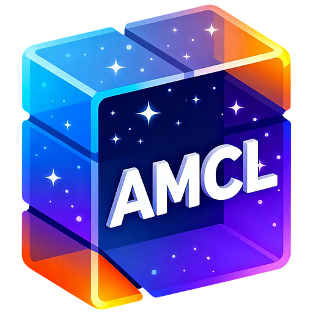

# Astra Minecraft Launcher

  
<strong>English</strong> | <a href="./docs/README_zh-cn.md">简体中文</a>
  

---
## Introduction  
AMCL is a modern, open-source Minecraft launcher built with Python and PySide6. It puts every feature right where you expect—no digging through nested menus. Instantly find Mod Management, Game Customizing, ModLoader installs (Forge, NeoForge, Fabric, Quilt, LiteLoader, OptiFine), one-click Mod-pack creation, UI themes, and more from the first screen.

AMCL runs everywhere: Windows, Linux, macOS, FreeBSD, and already-tested on x86-64, ARM, fully-featured, and intuitively laid-out—launch Minecraft the easy way.

## License
The software is distributed under [Eclipse Public License v2.0](https://www.eclipse.org/legal/epl-2.0/).

You may distribute this launcher in closed-source form **only if you do not modify any of its code**.  
If you modify it, you must share the full source code of your changes under the same license.

Include this license file and preserve all copyright notices.

**Note: EPL v2.0 is more permissive than GPL v3.0, as it allows unmodified binaries to be distributed privately or publicly without source code disclosure.**
